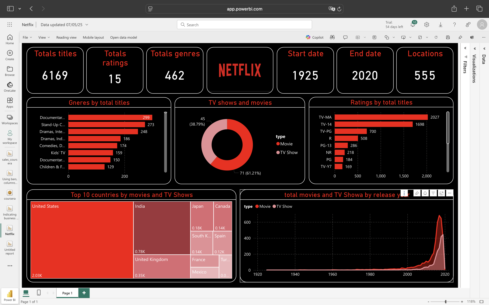

# 🎬 Netflix Content Analysis – Power BI

This interactive Power BI dashboard provides a comprehensive analysis of Netflix’s available content. It allows users to explore titles by genre, production country, release year trends, and ratings. The dashboard is designed to help users understand how Netflix's content is distributed and how it has evolved over time.

## 📊 Dashboard Features

- **🔢 Total Titles**: Displays the total number of shows and movies on the platform.
- **🎭 Popular Genres**: Highlights the most frequent genres in the Netflix catalog.
- **🌎 Country of Production**: Visualizes which countries contribute the most content to Netflix.
- **📅 Release Year Trends**: Line or bar chart showing the evolution of Netflix content releases over the years.
- **⭐ Ratings Breakdown** *(optional if included)*: Helps identify the most common ratings among available content.

## 📦 Tech Stack

- **Tool**: Power BI
- **Data Source**: Netflix titles dataset (e.g., from Kaggle or official Netflix datasets)
- **Visuals Used**:
  - KPIs
  - Bar Charts
  - Pie/Donut Charts
  - Line Charts

## 🧠 Insights Gained

- The number of new titles has fluctuated over the years, with certain spikes in content production.
- Drama and Comedy are among the most represented genres.
- The United States is the top-producing country, followed by India and the UK.
- Recent years saw an increase in international and non-English content.

### 📷 Screenshot:

## 📝 Author

- Dashboard by [Mariam Raafat]
- Created as part of a data visualization learning journey
